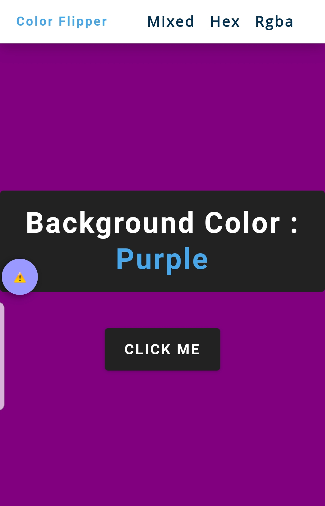
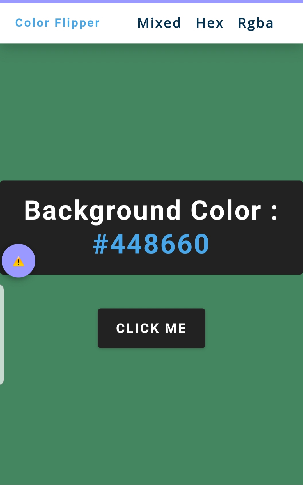

# Color-flipper

## Side Hustle Internship 3.0: My solution to task 4

### Description:
This is a color flipper I built as my solution to task 4 ***@side hustle internship***. It basically changes the background color to random colors on the click of the button (click me).

### How it works:
Color representation are divided into three sections viz: **Mixed**, **hex** and **rgba**. Mixed displays colors in mixed format (i.e simple representation of colors e.g red), hex displays hexadecimal colors while rgba displays colors in its rgb format. Tap on any of the three set of color representation at the top right corner, then continuously click on the button(click me) to randomly display different colors of the specified format.

*Hexadecimal color representation*

### Technology used:
-**HTMl** for marking up the page.

-**CSS** for styling and responsiveness.

-**Javascript:** was used extensively to add functionalities and interactivity

### Links:

https://itossudong.github.io/Color-flipper/

